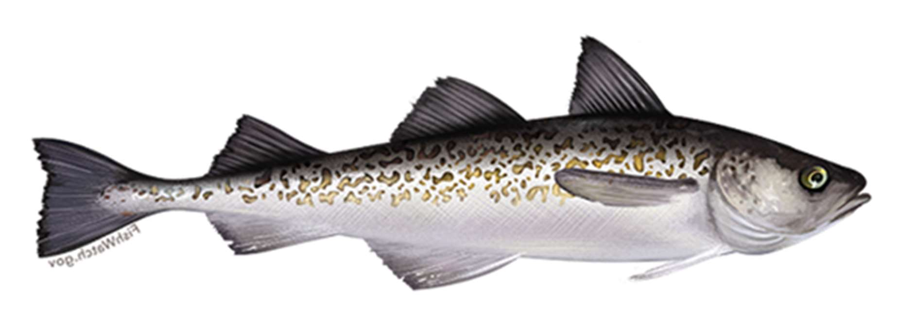

\providecommand{\printnoidxglossaries}{}
\printnoidxglossaries 

```{r} 
#| label: 'doc_parameters'
#| echo: false 
#| warnings: false 
#| eval: true
# Parameters 
spp <- params$species 
SPP <- params$species
species <- params$species 
spp_latin <- params$spp_latin 
office <- params$office
region <- params$region

asar_root <- if (!is.null(params$asar_root) && nzchar(params$asar_root)) {
  params$asar_root
} else {
  normalizePath(file.path(getwd(), ".."), mustWork = FALSE)
}
tables_dir <- if (!is.null(params$tables_dir) && nzchar(params$tables_dir)) {
  params$tables_dir
} else {
  file.path(asar_root, "tables")
}
figures_dir <- if (!is.null(params$figures_dir) && nzchar(params$figures_dir)) {
  params$figures_dir
} else {
  file.path(asar_root, "figures")
}
ebs_dir <- if (!is.null(params$ebs_dir) && nzchar(params$ebs_dir)) {
  params$ebs_dir
} else {
  Sys.getenv("ASAR_EBS_DIR", unset = "/Users/jim/_mymods/noaa-afsc/ebs_pollock")
}
``` 

```{r} 
#| label: 'output_and_quantities'
#| warning: false 
#| eval: true 
#| include: false
# load converted output from asar::convert_output() 
load("std_output_admb.rda") 
# Call reference points and quantities below 
output <- out_new |> 
  dplyr::mutate(estimate = as.numeric(estimate), 
    uncertainty = as.numeric(uncertainty)) 
source("preamble.R") 
# Available quantities
start_year
end_year
Fend # terminal fishing mortality
Ftarg # fishing mortality at msy
F_Ftarg # Terminal year F respective to F target
Bend # terminal year biomass
Btarg # target biomass (msy)
total_catch # total catch in the last year
total_landings # total landings in the last year
SBend # spawning biomass in the last year
M # overall natural mortality or at age
Bmsy # target spawning biomass(msy)
h # steepness
R0 # recruitment

``` 

::: {.content-visible when-format="html"}
<div style="text-align: center; margin: 1.25rem 0 1.75rem 0;">
  
</div>
:::



## Disclaimer {.unnumbered .unlisted}

These materials do not constitute a formal publication and are for information only. They are in a pre-review, pre-decisional state and should not be formally cited or reproduced. They are to be considered provisional and do not represent any determination or policy of NOAA or the Department of Commerce.

 

Please cite this publication as: 

Ianelli, J., C. McGilliard, and S. Wassermann. 2025. Assessment of the Walleye pollock Stock in the Eastern Bering Sea. National Marine Fisheries Service, Seattle, WA. \pageref*{LastPage}{} pp.

  

```{r, results='asis'}
#| label: 'executive_summary'
#| eval: true
#| echo: false
#| warning: false
a <- knitr::knit_child('01_executive_summary.qmd', quiet = TRUE)
cat(a, sep = '\n')
```

  

```{r, results='asis'}
#| label: 'introduction'
#| eval: true
#| echo: false
#| warning: false
a <- knitr::knit_child('02_introduction.qmd', quiet = TRUE)
cat(a, sep = '\n')
```

  

```{r, results='asis'}
#| label: 'data'
#| eval: true
#| echo: false
#| warning: false
a <- knitr::knit_child('03_data.qmd', quiet = TRUE)
cat(a, sep = '\n')
```

  

```{r, results='asis'}
#| label: 'assessment-configuration'
#| eval: true
#| echo: false
#| warning: false
a <- knitr::knit_child('04a_assessment-configuration.qmd', quiet = TRUE)
cat(a, sep = '\n')
```

  

```{r, results='asis'}
#| label: 'assessment-results'
#| eval: true
#| echo: false
#| warning: false
a <- knitr::knit_child('04b_assessment-results.qmd', quiet = TRUE)
cat(a, sep = '\n')
```

  

```{r, results='asis'}
#| label: 'assessment-sensitivity'
#| eval: true
#| echo: false
#| warning: false
a <- knitr::knit_child('04c_assessment-sensitivity.qmd', quiet = TRUE)
cat(a, sep = '\n')
```

  

```{r, results='asis'}
#| label: 'assessment-benchmarks'
#| eval: true
#| echo: false
#| warning: false
a <- knitr::knit_child('04d_assessment-benchmarks.qmd', quiet = TRUE)
cat(a, sep = '\n')
```

  

```{r, results='asis'}
#| label: 'assessment-projections'
#| eval: true
#| echo: false
#| warning: false
a <- knitr::knit_child('04e_assessment-projections.qmd', quiet = TRUE)
cat(a, sep = '\n')
```

  

```{r, results='asis'}
#| label: 'discussion'
#| eval: true
#| echo: false
#| warning: false
a <- knitr::knit_child('05_discussion.qmd', quiet = TRUE)
cat(a, sep = '\n')
```

  

```{r, results='asis'}
#| label: 'acknowledgments'
#| eval: true
#| echo: false
#| warning: false
a <- knitr::knit_child('06_acknowledgments.qmd', quiet = TRUE)
cat(a, sep = '\n')
```

  

```{r, results='asis'}
#| label: 'references'
#| eval: true
#| echo: false
#| warning: false
a <- knitr::knit_child('07_references.qmd', quiet = TRUE)
cat(a, sep = '\n')
```

  

```{r, results='asis'}
#| label: 'tables'
#| eval: true
#| echo: false
#| warning: false
a <- knitr::knit_child('08_tables.qmd', quiet = TRUE)
cat(a, sep = '\n')
```

  

```{r, results='asis'}
#| label: 'figures'
#| eval: true
#| echo: false
#| warning: false
a <- knitr::knit_child('09_figures.qmd', quiet = TRUE)
cat(a, sep = '\n')
```

  

```{r, results='asis'}
#| label: 'appendix'
#| eval: true
#| echo: false
#| warning: false
a <- knitr::knit_child('11_appendix.qmd', quiet = TRUE)
cat(a, sep = '\n')
```
